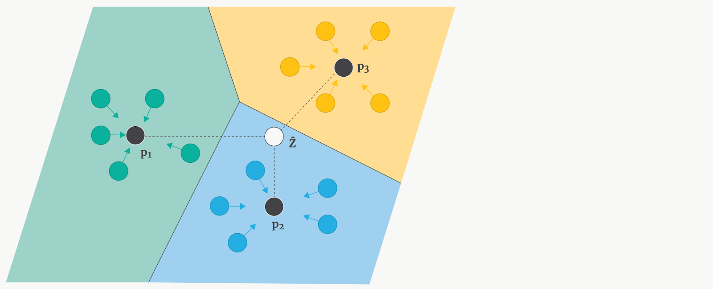
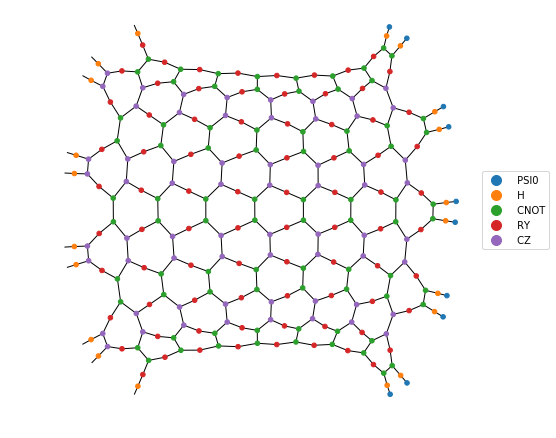
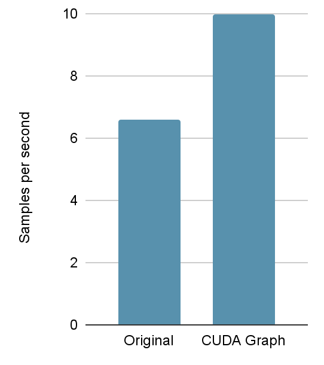

# Fidelity-Based Quantum-Classical Few-Shot Learning

This project was submitted for the iQuHACK 2022 challenge. 

Humans learn new concepts with very little supervision – e.g. a child can generalize the concept of “giraffe” from a single picture in a book – yet our best deep learning systems need hundreds or thousands of examples. [^1] Few-shot classification is a task in which a classifier must be adapted to accommodate new classes not seen in training, given only a few examples of each of these classes. [2] In practice, few-shot learning is useful when training examples are hard to find (e.g., cases of a rare disease), or where the cost of labeling data is high.

### Table of Contents  
1. [Introduction to Machine Learning and Quantum Machine Learning](#toc1)
2. [Building the Machine Learning Pipeline](#toc2)
3. [QTensor/QTensorAI and integration with the Few-Shot Model](#toc3)
4. [Quantum Circuit for the calculation of Inner Product](#toc4)
5. [Medical Dataset and Real World Application](#toc5)
6. [Results](#toc6)
7. [Installation Guide](#toc7)
8. [References](#toc8)

<a name="toc1"></a>

## Introduction to Machine Learning and Quantum Machine Learning

State-of-the-art models utilize sampled mini-batches called episodes during training, where each episode is designed to mimic the few-shot task by subsampling classes as well as data points. [^2] The model, therefore, learns to extract embeddings for each sample that are useful for different few-shot tasks. The embeddings of the examples and the queries are compared by a distance metric, and the predicted class minimizes such distances.

We replace the classical model with a hybrid quantum-classical embedding. Images are classically processed through convolution, and the final low-dimensional vectors can be used as variational parameters to a quantum circuit. The model essentially learns embeddings in the quantum Hilbert space. The high dimensionality of the Hilbert space of the circuit means that the circuit can potentially model kernels that are classically hard to model. This is the quantum kernel method [^3]. The distance between the quantum embeddings can be then estimated as the square of the inner product of their respective wavefunctions.

We simulate large quantum circuits with QTensor [^4], a tensor network simulator [^5]. Tensor networks move the simulation complexity to (in a sense) the depth of the circuit and are linear in the number of qubits. There is great potential in demonstrating the feasibility of this approach using this simulator.

Additionally, we are going to run our hybrid quantum-classical model on the provided quantum hardware to see the performance differences between the simulation and the physical machine. Our aim is to run the model on the backends with different modalities: Trapped Ion from IonQ and Superconducting qubits from IBM. The purpose of this comparison is to benchmark hardware against a simulation to see the effects of noise and corresponding error correction and to build on the 2017 comparison between these quantum architectures[^6]. 

Our project will be building on top of [the code used for the "Prototypical networks for few-shot learning." by Snell et al.](https://github.com/jakesnell/prototypical-networks)

| | |
| :--------------: | :---------: 
|  | 

<a name="toc2"></a>
## Building the Machine Learning Pipeline
| |
| :--------------: |
|  |

<a name="toc3"></a>
## QTensor/QTensorAI and integration with the Few-Shot Model

Quantum computers are hard to simulate classically, and this is a good thing in the long run,
since we wouldn't need quantum computing otherwise. However we do need to simulate quantum computers
classically to design and fine-tune quantum algorithms. This is where tensor networks [^8] come to help.
 
This is an example tensor network:

!()[Assets/tensornet.png]

The simulation of quantum circuit is limited by memory required to simulate. Tensor networks allow to 
take advantage of structure of a quantum circuit to reduce memory footprint of the simulation[^9]

Please view [this code](./QTensorAI) for the technical implementation of this section. 

QTensor is a tensor network-based quantum simulator. Quantum operations are treated as tensors whose indices corresponds to their input and output qubits.

| Diagonal Gates | Non-Diagonal Gates |
| :--------------: | :---------: 
|  | |

QTensorAI is a library that enables the utilization of the QTensor quantum simulator within PyTorch machine learning pipelines. The library offers a few circuit ansatz simulators wrapped as nn.Module classes, and other tools to allow users to construct their own ML-friendly circuit ansatzes. Further, QTensorAI changes the dynamic implementation of QTensor to static, making it friendly to CUDA Graph optimization, which eliminates CPU side kernel launch overhead and can lead to a significant speed-up. Combined with the added capability of batch parallelism, QTensorAI optimizes large machine learning tasks and removes significant overhead in quantum simulations.

| |
| :--------------: |
|  |

| 50 qubit 8 variational layer prototypical networks | 32 qubit 4 variational layer temporal convolution |
| :--------------: | :---------: 
|  | |


<a name="toc4"></a>
## Quantum Circuit for the calculation of Inner Product
Please view [this notebook](./azure_ionq/Running_Circuits.ipynb) for the technical implementation of this section. 


<a name="toc5"></a>
## Medical Dataset and Real World Application

<a name="toc6"></a>
## Results

<a name="toc7"></a>

## Installation Guide ##

### QTensor Installation ###

First, you need to install QTensor from [source code](https://github.com/danlkv/qtensor).

```bash
# --recurse-submodules is important since qtensor has a submodule qtree  
git clone --recurse-submodules https://github.com/DaniloZZZ/QTensor
cd QTensor

# using git branch -v -a to check all branchs
# and switch to dev branch
git switch dev
# checkout the specific commit 
git checkout dc53509

cd qtree
pip install .

cd .. # back to QTensor folder
pip install .
```

You can check if the `qtensor` and `qtree` are installed or not using `pip3 list`

### QTensorAI Installation ###

```bash
cd QTensorAI
python3 setup.py install
```

You can check if the `qtensor-ai` is installed or not using `pip3 list`

<a name="toc8"></a>

## References
[^1]: Vinyals, Oriol, Charles Blundell, Timothy Lillicrap, and Daan Wierstra. "Matching networks for one shot learning." Advances in neural information processing systems 29 (2016): 3630-3638.
[^2]: Snell, Jake, Kevin Swersky, and Richard S. Zemel. "Prototypical networks for few-shot learning." arXiv preprint arXiv:1703.05175 (2017).
[^3]: Havlíček, Vojtěch, Antonio D. Córcoles, Kristan Temme, Aram W. Harrow, Abhinav Kandala, Jerry M. Chow, and Jay M. Gambetta. "Supervised learning with quantum-enhanced feature spaces." Nature 567, no. 7747 (2019): 209-212.
[^4]: Lykov, Danylo, Roman Schutski, Alexey Galda, Valerii Vinokur, and Yurii Alexeev. "Tensor network quantum simulator with step-dependent parallelization." arXiv preprint arXiv:2012.02430 (2020).
[^5]: Boixo, Sergio, Sergei V. Isakov, Vadim N. Smelyanskiy, and Hartmut Neven. "Simulation of low-depth quantum circuits as complex undirected graphical models." arXiv preprint arXiv:1712.05384 (2017).
[^6]: Linke, Norbert M., Dmitri Maslov, Martin Roetteler, Shantanu Debnath, Caroline Figgatt, Kevin A. Landsman, Kenneth Wright, and Christopher Monroe. "Experimental comparison of two quantum computing architectures." Proceedings of the National Academy of Sciences 114, no. 13 (2017): 3305-3310.
[^7]: Koch, Gregory R.. “Siamese Neural Networks for One-Shot Image Recognition.” (2015).
[^8]: Jacob Biamonte and Ville Bergholm "Tensor Networks in a Nutshell" https://arxiv.org/abs/1708.00006
[^9]: "Tensor Network Quantum Simulator With Step-Dependent Parallelization
" https://arxiv.org/abs/2012.02430